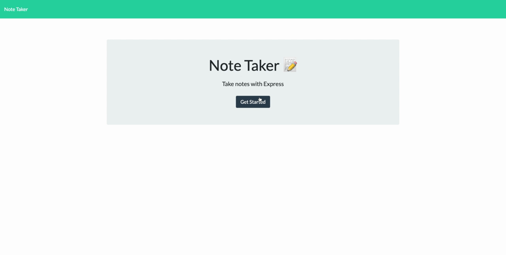

# Note Taker

## Table of Contents:

- [Description](#description)
- [Installation](#installation)
- [Usage](#usage)
- [Contributing](#contributing)
- [License](#license)
- [Questions](#questions)

## Description

This application allows users to use a web interface to create, save and delete notes with titles and content. It uses `node.js` & `JavaScript`, and `express.js` The app also allows users to navigate to notes that were taken previously.

Live application hosted on Heroku: https://note-taker-app-mrb.herokuapp.com/

## Installation

To install necessary dependencies, run the following command:

    npm i

## Usage

After pulling down the repository, start the express server by running `node server.js`. Then, open a browser and navigate to http://localhost:3001 (a live version is hosted at https://note-taker-app-mrb.herokuapp.com/). You will be prompted to open the app by clicking "Get Started." To create a new note, click in the "Note Title" section and add a title. Then, click in the "Note Text" section and add the contents of your note. When both the title and content are filled in, a "save" button will appear in the upper-right corner, which can be clicked to save the note to the list. To delete a note, click the trash can icon next to the note you want to delete. Click on previous notes to pull up their content.

## License

This project is licensed under [License: MIT](https://opensource.org/licenses/MIT)

## Contributing

To contribute to this project (or any others), please contact me using the information in the Questions section below or by submitting a pull request.

> For more information on project contribution guidelines, please reference [Contributor Covenant](https://www.contributor-covenant.org/)

## Questions?

If you have any questions, please feel free to reach out. Thanks!

GitHub: https://github.com/matthewbush55

Email: matthewbush55@gmail.com
